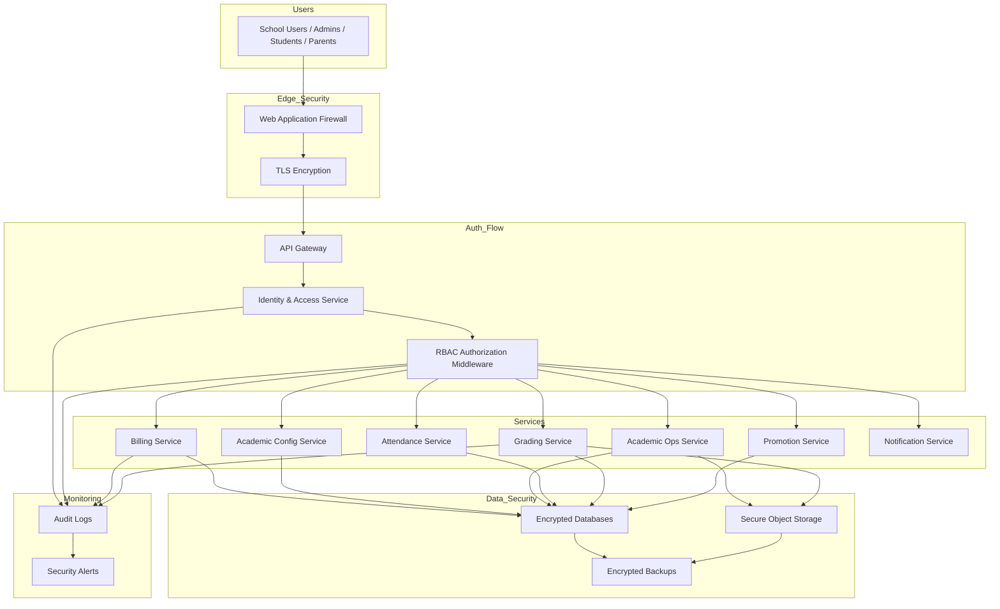

# AcademiQ Security Architecture

🧠 What This Architecture Covers

This diagram shows how AcademiQ protects:

User identity

Access to features

Sensitive student data

System integrity

It spans authentication, authorization, data protection, and auditing.

🌐 Edge Security
🧱 Web Application Firewall (WAF)

Blocks:

SQL injection

XSS

Bot abuse

Suspicious IP traffic

First defensive layer before traffic reaches your app.

🔒 TLS Encryption

All traffic between users and the system is encrypted via HTTPS.

Prevents:

Credential sniffing

Session hijacking

🔑 Authentication Flow
API Gateway → IAM

User logs in

IAM verifies credentials

IAM issues JWT access token

Token contains:

User ID

Tenant ID

Roles

🛂 RBAC Enforcement
RBAC Middleware (after authentication)

Every request is checked for:

Role (Teacher, Admin, Parent…)

Tenant scope

Permission (e.g., grade:write, attendance:read)

RBAC sits before services, so services don’t duplicate auth logic.

🗄 Data Protection
🔐 Encrypted Databases

All service databases use:

Disk-level encryption

Encrypted backups

📂 Secure Object Storage

Student photos, documents, report PDFs:

Private buckets

Signed URL access

No public exposure

💾 Encrypted Backups

Backups are encrypted and stored separately from production.

📜 Audit & Monitoring
Audit Logs

Critical actions recorded:

Login attempts

Role changes

Grade edits

Billing updates

Stored centrally for compliance and investigations.

🚨 Security Alerts

Triggered on:

Multiple failed logins

Privilege escalation

Suspicious API usage

🎯 What This Achieves

✔ Prevents unauthorized access
✔ Protects student personal data
✔ Supports compliance (education data protection)
✔ Provides traceability of sensitive actions
